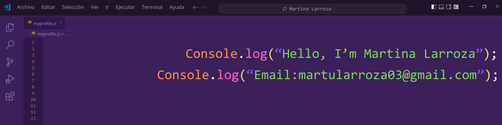

# 👋 Hola, soy Martina

Soy **Técnica Programadora** especializada en **Desarrollo Backend**. Tengo experiencia trabajando con diversas tecnologías, como:

- **Lenguajes**: C#, Python, PHP
- **Frameworks**: .NET, Flask
- **Bases de Datos**: MySQL, PostgreSQL
- Actualmente estoy estudiando **Ciberseguridad** para expandir mis conocimientos en seguridad de software.

## 📫 Contacto

- **LinkedIn**: [Martina Larroza](https://www.linkedin.com/in/martina-larroza/) 
- **Email**: [martularroza03@gmail.com](martularroza03@gmail.com)

<!--
**martinalarroza/martinalarroza** is a ✨ _special_ ✨ repository because its `README.md` (this file) appears on your GitHub profile.

Here are some ideas to get you started:

- 🔭 I’m currently working on ...
- 🌱 I’m currently learning ...
- 👯 I’m looking to collaborate on ...
- 🤔 I’m looking for help with ...
- 💬 Ask me about ...
- 📫 How to reach me: ...
- 😄 Pronouns: ...
- ⚡ Fun fact: ...
-->
